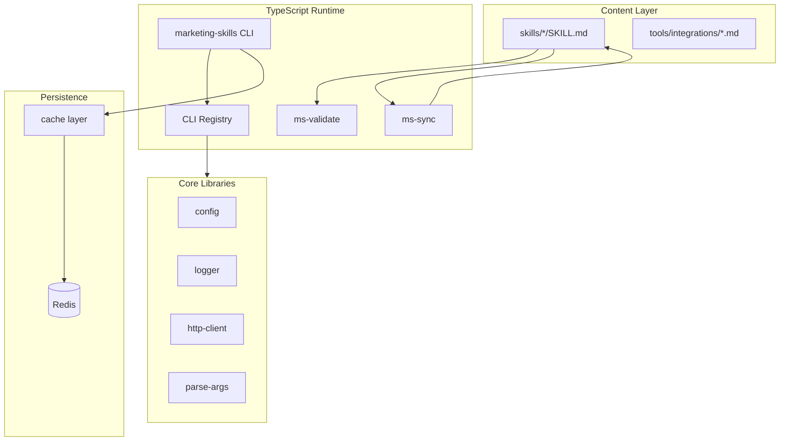
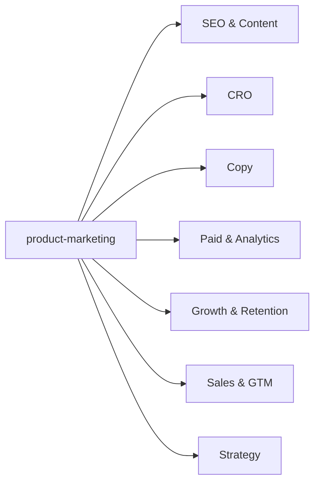
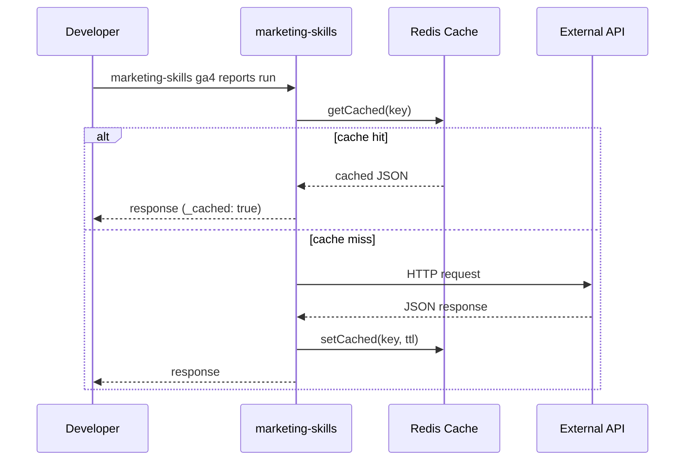

# Marketing Skills

A production-ready toolkit for AI agents working on marketing tasks. Ships **51+ Agent Skills** (markdown workflows) and a **TypeScript CLI platform** with optional **Redis-backed response caching**.

Built for engineers and technical marketers who want reproducible, testable tooling around conversion optimization, copywriting, SEO, analytics, and growth workflows.

---

## Feature Highlights

| Capability | Description |
|------------|-------------|
| **Agent Skills** | Spec-compliant `SKILL.md` files for Claude Code, Cursor, Codex, and other Agent Skills hosts |
| **Unified CLI** | Single `marketing-skills` entry point for 64 marketing tool integrations |
| **Redis cache** | Optional persistence layer for CLI responses with graceful shutdown |
| **Strict TypeScript** | Typed core libraries, ESLint, Vitest, and CI validation |
| **Cross-platform validation** | Node-based skill validator (replaces bash-only audit) |
| **Plugin marketplace** | Claude Code plugin manifest in `.claude-plugin/` |

---

## Architecture



### Skill dependency model



Every skill reads **product-marketing** context first for positioning, audience, and messaging consistency.

---

## Project Structure

```
marketingskills/
├── src/                    # TypeScript application code
│   ├── cli.ts              # Unified CLI entry
│   ├── config/             # Environment configuration (Zod)
│   ├── lib/
│   │   ├── cli/            # Argument parsing, HTTP helpers
│   │   ├── logger/         # Structured logging
│   │   └── redis/          # Connection manager + cache
│   ├── skills/             # Sync + validate modules
│   └── clis/               # Per-tool CLI handlers (64 tools)
├── skills/                 # Agent Skills content (unchanged spec)
├── tools/
│   ├── clis/               # CLI documentation
│   └── integrations/       # API integration guides
├── tests/                  # Vitest unit tests
├── docs/                   # Engineering documentation
├── dist/                   # Build output (gitignored)
└── .claude-plugin/         # Claude Code marketplace manifest
```

**Design decisions**

- **Content vs runtime separation** — Skills remain portable markdown; runtime code lives under `src/`.
- **Thin CLI modules** — Each tool exports a `run(args)` handler; shared logic lives in `src/lib/`.
- **Optional Redis** — Disabled via `REDIS_ENABLED=false` for local development without infrastructure.

---

## Installation

### Prerequisites

- Node.js 18+
- npm 9+
- Redis 6+ (optional, for caching)

### Setup

```bash
git clone https://github.com/coreyhaines31/marketingskills.git
cd marketingskills
npm install
cp .env.example .env
npm run build
```

### Install skills into your project

```bash
npx skills add coreyhaines31/marketingskills
```

Or install individual skills from the `skills/` directory into `.agents/skills/`.

---

## Configuration

Copy `.env.example` to `.env` and adjust:

| Variable | Default | Description |
|----------|---------|-------------|
| `LOG_LEVEL` | `info` | Logging verbosity |
| `REDIS_ENABLED` | `true` | Set `false` to disable Redis |
| `REDIS_URL` | `redis://127.0.0.1:6379` | Redis connection URL |
| `REDIS_KEY_PREFIX` | `ms:` | Key namespace prefix |
| `REDIS_CACHE_TTL_SECONDS` | `300` | CLI response cache TTL |
| `SKILLS_DIR` | `skills` | Skills directory path |

Tool-specific API keys (e.g. `GA4_ACCESS_TOKEN`, `APOLLO_API_KEY`) are read at runtime by each CLI module.

---

## Development

```bash
# Watch mode
npm run dev

# Type check
npm run typecheck

# Lint
npm run lint

# Test
npm run test

# Full pipeline
npm run validate
```

### CLI usage

```bash
npx marketing-skills list
npx marketing-skills ga4 reports run --property 123456789 --dry-run
npx marketing-skills apollo people search --titles "CEO,CTO"
```

### Skill maintenance

```bash
npm run sync-skills      # Update README table + marketplace.json
npm run validate-skills  # Audit all SKILL.md files
```

---

## Testing

```bash
npm test              # Run all unit tests
npm run test:watch    # Watch mode
```

Tests cover argument parsing, configuration loading, skill discovery/validation, Redis connection management, and cache key generation.

---

## Workflow



---

## Troubleshooting

### `Redis connection failed`

- Confirm Redis is running: `redis-cli ping`
- Set `REDIS_ENABLED=false` for local dev without Redis
- Check `REDIS_URL` format

### `Unknown tool: xyz`

Run `npx marketing-skills list` for available tools. Tool names match the legacy `tools/clis/` filenames (e.g. `ga4`, `apollo`).

### `GA4_ACCESS_TOKEN environment variable required`

Each tool requires its own API credentials. See `tools/integrations/` for setup guides.

### Skill validation failures

Run `npm run validate-skills` for detailed per-skill errors. Common issues:

- `name` must match directory name (lowercase, hyphens only)
- `description` must include trigger phrases
- `SKILL.md` should stay under 500 lines

### Build errors after pulling

```bash
rm -rf dist node_modules
npm install
npm run build
```

---

## Contributing

1. Fork the repository
2. Create a feature branch
3. Run `npm run validate` before committing
4. Follow the [Agent Skills specification](https://agentskills.io/specification.md)
5. Open a pull request with a clear description

See `CONTRIBUTING.md` for skill authoring guidelines.

---

## FAQ

**Is this a fork of the original Marketing Skills repo?**  
Yes — this version adds a TypeScript runtime, Redis caching, tests, and CI while preserving the original skill content and workflows.

**Do I need Redis?**  
No. Set `REDIS_ENABLED=false` and the CLI works without caching.

**Can I still use individual tool scripts?**  
Use `npx marketing-skills <tool>` instead of standalone `node tools/clis/*.js` scripts.

**Are skills still markdown-only?**  
Yes. Skills under `skills/` remain content files with no build step.

**How do skills relate to CLIs?**  
Skills provide agent workflows; CLIs provide JSON API access to external marketing tools referenced in those workflows.

---

## Skills Index

<!-- SKILLS:START -->
| Skill | Description |
|-------|-------------|
| [ab-testing](skills/ab-testing/) | When the user wants to plan, design, or implement an A/B test or experiment, or build a growth experimentation program.... |
| [ad-creative](skills/ad-creative/) | When the user wants to generate, iterate, or scale ad creative — headlines, descriptions, primary text, or full ad... |
| [ads](skills/ads/) | When the user wants help with paid advertising campaigns on Google Ads, Meta (Facebook/Instagram), LinkedIn, Twitter/X,... |
| [ai-seo](skills/ai-seo/) | When the user wants to optimize content for AI search engines, get cited by LLMs, or appear in AI-generated answers.... |
| [analytics](skills/analytics/) | When the user wants to set up, improve, or audit analytics tracking and measurement. Also use when the user mentions... |
| [aso](skills/aso/) | When the user wants to audit or optimize an App Store or Google Play listing. Also use when the user mentions 'ASO... |
| [churn-prevention](skills/churn-prevention/) | When the user wants to reduce churn, build cancellation flows, set up save offers, recover failed payments, or... |
| [co-marketing](skills/co-marketing/) | When the user wants to find co-marketing partners, plan joint campaigns, or brainstorm partnership opportunities. Use... |
| [cold-email](skills/cold-email/) | Write B2B cold emails and follow-up sequences that get replies. Use when the user wants to write cold outreach emails,... |
| [community-marketing](skills/community-marketing/) | Build and leverage online communities to drive product growth and brand loyalty. Use when the user wants to create a... |
| [competitor-profiling](skills/competitor-profiling/) | When the user wants to research, profile, or analyze competitors from their URLs. Also use when the user mentions... |
| [competitors](skills/competitors/) | When the user wants to create competitor comparison or alternative pages for SEO and sales enablement. Also use when... |
| [content-strategy](skills/content-strategy/) | When the user wants to plan a content strategy, decide what content to create, or figure out what topics to cover. Also... |
| [copy-editing](skills/copy-editing/) | When the user wants to edit, review, or improve existing marketing copy, or refresh outdated content. Also use when the... |
| [copywriting](skills/copywriting/) | When the user wants to write, rewrite, or improve marketing copy for any page — including homepage, landing pages,... |
| [cro](skills/cro/) | When the user wants to optimize, improve, or increase conversions on any marketing page or form — including homepage,... |
| [customer-research](skills/customer-research/) | When the user wants to conduct, analyze, or synthesize customer research. Use when the user mentions "customer... |
| [directory-submissions](skills/directory-submissions/) | When the user wants to submit their product to startup, SaaS, AI, agent, MCP, no-code, or review directories for... |
| [emails](skills/emails/) | When the user wants to create or optimize an email sequence, drip campaign, automated email flow, or lifecycle email... |
| [free-tools](skills/free-tools/) | When the user wants to plan, evaluate, or build a free tool for marketing purposes — lead generation, SEO value, or... |
| [image](skills/image/) | When the user wants to create, generate, edit, or optimize images for marketing — blog heroes, social graphics, product... |
| [launch](skills/launch/) | When the user wants to plan a product launch, feature announcement, or release strategy. Also use when the user... |
| [lead-magnets](skills/lead-magnets/) | When the user wants to create, plan, or optimize a lead magnet for email capture or lead generation. Also use when the... |
| [marketing-ideas](skills/marketing-ideas/) | When the user needs marketing ideas, inspiration, or strategies for their SaaS or software product. Also use when the... |
| [marketing-plan](skills/marketing-plan/) | When the user needs a comprehensive marketing plan for a client, a company they advise, or their own product. Also use... |
| [marketing-psychology](skills/marketing-psychology/) | When the user wants to apply psychological principles, mental models, or behavioral science to marketing. Also use when... |
| [offers](skills/offers/) | When the user wants to design, construct, or improve an offer — the thing they actually sell — including value framing,... |
| [onboarding](skills/onboarding/) | When the user wants to optimize post-signup onboarding, user activation, first-run experience, or time-to-value. Also... |
| [paywalls](skills/paywalls/) | When the user wants to create or optimize in-app paywalls, upgrade screens, upsell modals, or feature gates. Also use... |
| [popups](skills/popups/) | When the user wants to create or optimize popups, modals, overlays, slide-ins, or banners for conversion purposes. Also... |
| [pricing](skills/pricing/) | When the user wants help with pricing decisions, packaging, or monetization strategy. Also use when the user mentions... |
| [product-marketing](skills/product-marketing/) | When the user wants to create or update their product marketing context document. Also use when the user mentions... |
| [programmatic-seo](skills/programmatic-seo/) | When the user wants to create SEO-driven pages at scale using templates and data. Also use when the user mentions... |
| [prospecting](skills/prospecting/) | When the user wants to find, qualify, and build a list of prospects to reach out to — across B2B SaaS, general B2B, or... |
| [public-relations](skills/public-relations/) | When the user wants help with public relations, earned media, press coverage, journalist outreach, or media strategy... |
| [referrals](skills/referrals/) | When the user wants to create, optimize, or analyze a referral program, affiliate program, or word-of-mouth strategy.... |
| [revops](skills/revops/) | When the user wants help with revenue operations, lead lifecycle management, or marketing-to-sales handoff processes.... |
| [sales-enablement](skills/sales-enablement/) | When the user wants to create sales collateral, pitch decks, one-pagers, objection handling docs, or demo scripts. Also... |
| [schema](skills/schema/) | When the user wants to add, fix, or optimize schema markup and structured data on their site. Also use when the user... |
| [seo-audit](skills/seo-audit/) | When the user wants to audit, review, or diagnose SEO issues on their site. Also use when the user mentions "SEO... |
| [signup](skills/signup/) | When the user wants to optimize signup, registration, account creation, or trial activation flows. Also use when the... |
| [site-architecture](skills/site-architecture/) | When the user wants to plan, map, or restructure their website's page hierarchy, navigation, URL structure, or internal... |
| [sms](skills/sms/) | When the user wants to plan, build, or optimize SMS or MMS marketing — including welcome flows, abandoned cart texts,... |
| [social](skills/social/) | When the user wants help creating, scheduling, or optimizing social media content for LinkedIn, Twitter/X, Instagram,... |
| [video](skills/video/) | When the user wants to create, generate, or produce video content using AI tools or programmatic frameworks. Also use... |
<!-- SKILLS:END -->

---

## License

MIT — see [LICENSE](LICENSE).
